# 🖥️ Guia Completa de Configuració SSH

## 1. Instal·lació de SSH a Ubuntu

Quan configurem la màquina Ubuntu, podem instal·lar SSH durant la configuració inicial.

Si no ho vam fer en aquell moment, també el podem instal·lar manualment:

```bash
sudo apt update && sudo apt install openssh-server
```

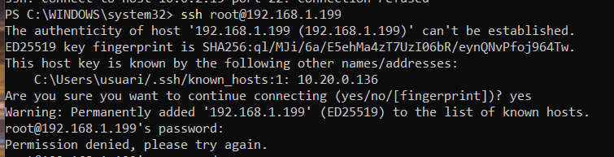

Un cop instal·lat, comprovem l’estat del servei:

```bash
sudo systemctl status ssh
```

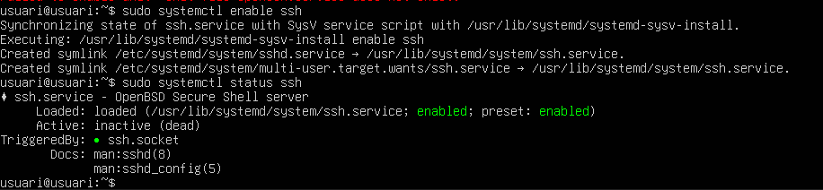

## 2. Instal·lació de SSH a Windows

### Opció 1: Des de configuració
1. Configuració > Sistema > Característiques opcionals
2. Clicar "Veure característiques"
3. Buscar "Client OpenSSH" i instal·lar
   


### Opció 2: PowerShell
```powershell
Add-WindowsCapability -Online -Name OpenSSH.Client~~~~0.0.1.0
```

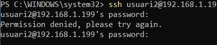
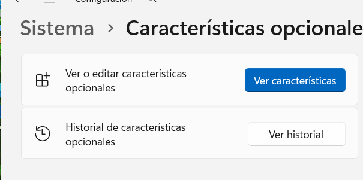

## 3. Connexió des de Windows a Ubuntu

També podem connectarnos des de PowerShell:

```powershell
ssh usuari@IP-del-servidor
```

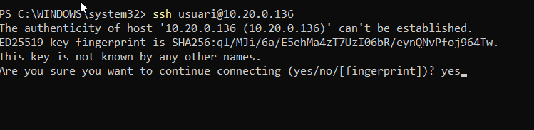

Verifiquem amb hostname:

```bash
hostname
```

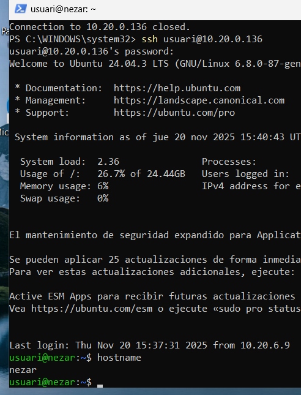

## 4. Creació d’un túnel SSH (Proxy SOCKS)

Creem un túnel (pots utilitzar qualsevol port que no utilitzi el sistema):
```bash
ssh -D 9876 usuari@IP-del-servidor
```


## 5. Configuració del Proxy a Windows

Configurem el proxy anant a:

Panell de control → Xarxa i Internet → Opcions d’Internet → Connexions → Configuració LAN


Habilitem Servidor Proxy amb IP local i port 9876.

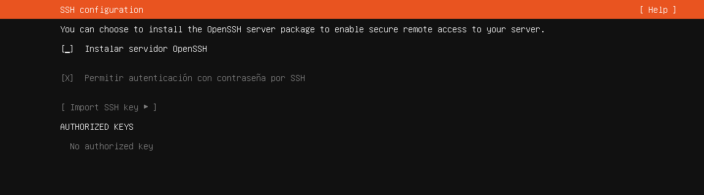
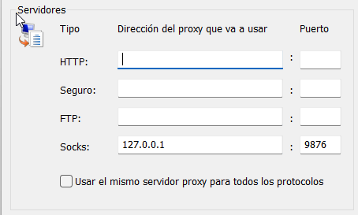

## 6. Validació del túnel amb Wireshark

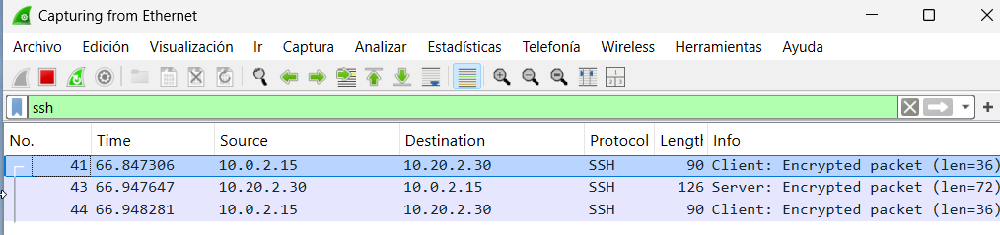

## 7. Control d’usuaris amb SSH

Habilitar root:

```bash
sudo passwd root
```


Crear nou usuari:

```bash
sudo adduser usuari2
```


Editar configuració:

```bash
sudo nano /etc/ssh/sshd_config
```

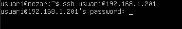

Afegir:

```
PermitRootLogin no
AllowUsers usuari usuari2
```

Reiniciar servei:

```bash
sudo systemctl restart ssh
```

I comprobem:


En canvi amb el que hem permès:

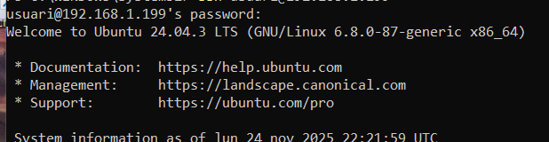

## 8. Autenticació amb claus SSH

Generar clau:

```powershell
ssh-keygen
```


Copiem la clau al servidor Ubuntu:

```powershell
scp id_rsa.pub usuari@IP:/home/usuari/
```

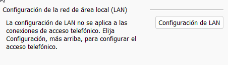

Posem la clau a la carpeta:

```bash
mkdir -p ~/.ssh
cat id_rsa.pub >> ~/.ssh/authorized_keys
chmod 600 ~/.ssh/authorized_keys
```

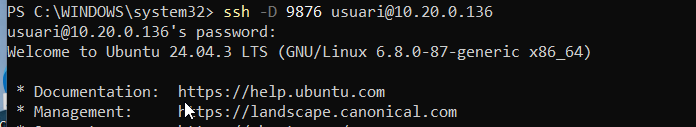

Comprovem si es connecta sense contrasenya:

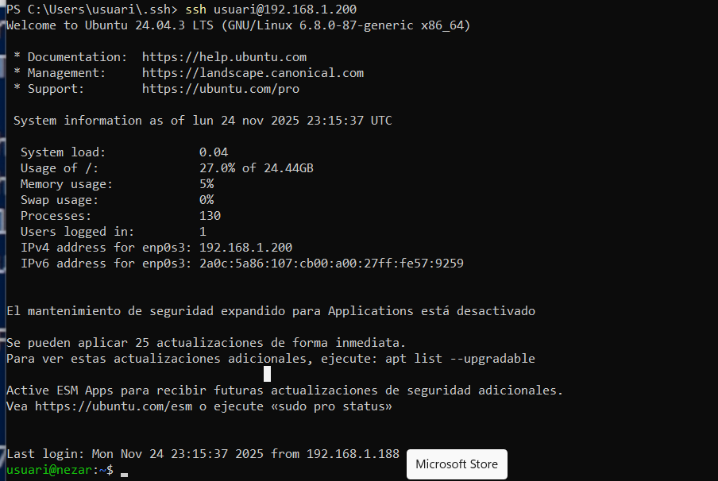

## 9. Connexió d’Ubuntu cap a Windows

Activar SSH a Windows:

```powershell
Start-Service sshd
Set-Service -Name sshd -StartupType Automatic
```

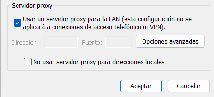

Connectem:

```bash
ssh usuari@IP-windows
```

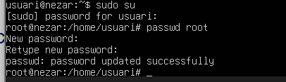
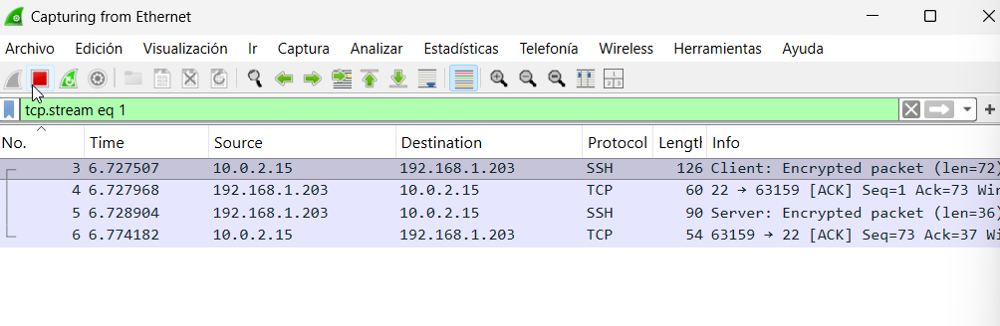

## I JA ESTARIA 👍

- [**Tornar al readme**](README.md)
- [**Tornar el projecte**](../README.md)
