# T07: Accés remot. Serveis d’assistència remota (tasca en parelles)

## Fase 1: Anàlisi comparativa i selecció de la solució

El primer pas és decidir quina eina utilitzarà EverPia. Pel que hem fet una anàlisi de mercat i un breu informe comparatiu entre les diferents eines d’assistència remota que hi ha al mercat. Un cop feta aquesta anàlisi, hem seleccionat l’eina que millor s’adapta a les necessitats de l’empresa i hem justificat la nostra elecció.

## Taula Comparativa d’Eines d’Assistència Remota

| Criteri | TeamViewer | AnyDesk | Google (Chrome) Remote Desktop | LogMeIn |
|-------|------------|---------|--------------------------------|---------|
| Facilitat d’ús (client) | Requereix descarregar l’aplicació o mòdul QuickSupport. L’usuari ha de facilitar un ID i una contrasenya. | Instal·lació ràpida i lleugera. ID visible i fàcil de comunicar. | Molt senzill si l’usuari té compte Google. Connexió via navegador i PIN. | Accés mitjançant aplicació o enllaç. Pensat per a entorns empresarials. |
| Instal·lació / Portable | Mòdul QuickSupport sense instal·lació completa | Instal·lació lleugera | No requereix instal·lació d’escriptori | Requereix instal·lació de l’agent |
| Windows | ✅ | ✅ | ✅ | ✅ |
| macOS | ✅ | ✅ | ✅ | ✅ |
| Linux | ✅ | ✅ | ✅ | No |
| Dispositius mòbils | ✅ | ✅ | ✅ | ✅ |
| Ús comercial permès en versió gratuïta | No | No | ✅ | No |
| Model de preu | Subscripció per tècnic | Subscripció (més econòmica) | Gratuït | Subscripció (cost elevat) |
| Limitacions de la versió gratuïta | Tall de sessions i detecció d’ús comercial | Funcions avançades limitades | Funcionalitats bàsiques | No disposa de versió gratuïta |

## Justificació de l’Eina Seleccionada

Després d’analitzar les diferents opcions disponibles, es recomana `TeamViewer` com a eina oficial d’assistència remota per a EverPia. Aquesta solució destaca per la seva gran fiabilitat, estabilitat i reconeixement al mercat professional, sent àmpliament utilitzada en entorns empresarials.

---

## 1. Introducció

Els serveis d’assistència remota són fonamentals dins d’una empresa IT, ja que permeten als tècnics donar suport als usuaris sense necessitat de presència física.

En aquesta tasca utilitzarem **TeamViewer**, una de les eines d’assistència remota més utilitzades en entorns professionals per la seva fiabilitat, facilitat d’ús i opcions de seguretat.

---

## 2. Versions de TeamViewer

TeamViewer disposa de diferents versions:

- **Versió web**
- **Versió d’escriptori**

👉 En aquesta pràctica **utilitzarem la versió d’escriptori**, ja que és la més completa i habitual en entorns corporatius.

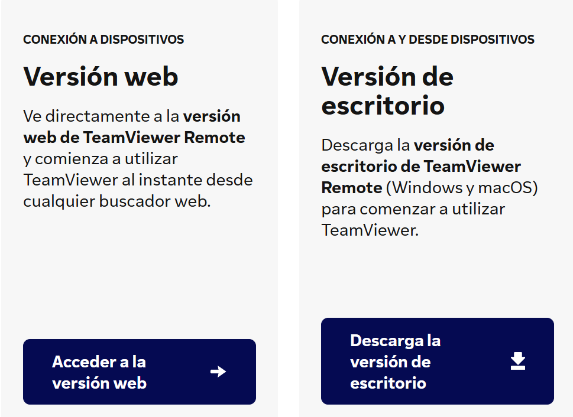

---

## 3. Descàrrega de TeamViewer

En accedir a la pàgina oficial de TeamViewer i fer clic a **Descarregar**, apareixen diverses opcions:

- **TeamViewer**
- **TeamViewer QuickSupport**

🔹 **Seleccionem TeamViewer QuickSupport**, ja que és la versió pensada per a l’usuari que rep assistència tècnica.

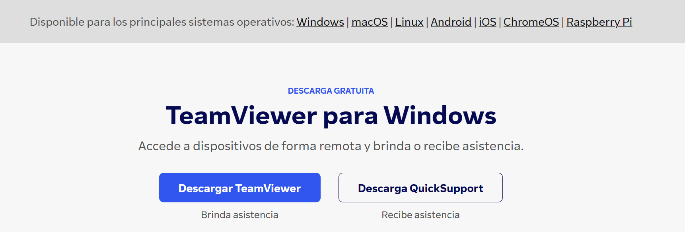

---

## 4. Execució del QuickSupport

La versió **QuickSupport és portable**, això vol dir que:

- ❌ No requereix instal·lació
- ✅ Només cal fer doble clic a l’arxiu descarregat

En obrir-lo apareix una finestra amb:
- **ID de l’equip**
- **Contrasenya temporal**
- Opcions de connexió segura
  
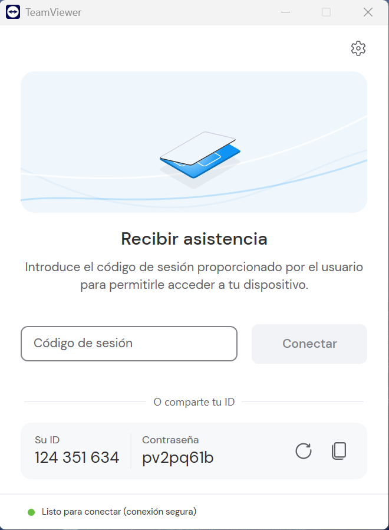

---

## 5. Maneres de connectar-se amb TeamViewer

Hi ha **dues maneres principals** perquè el tècnic accedeixi a l’equip de l’usuari:

---

### 5.1 Connexió mitjançant ID i contrasenya

1. L’usuari facilita el seu **ID** i la **contrasenya temporal** al tècnic.
   

2. El tècnic introdueix l’ID a TeamViewer.

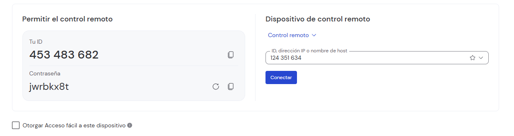   

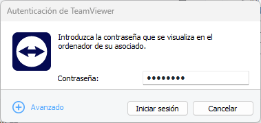
   
4. El tècnic accedeix a la sessió.

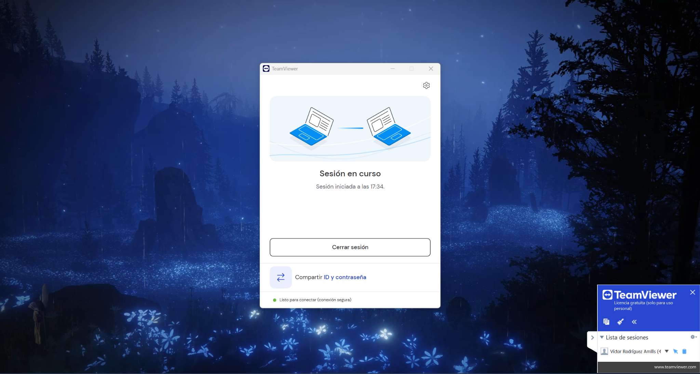

---

### 5.2 Connexió mitjançant codi o enllaç

1. El tècnic genera un **codi o enllaç de connexió**.
   
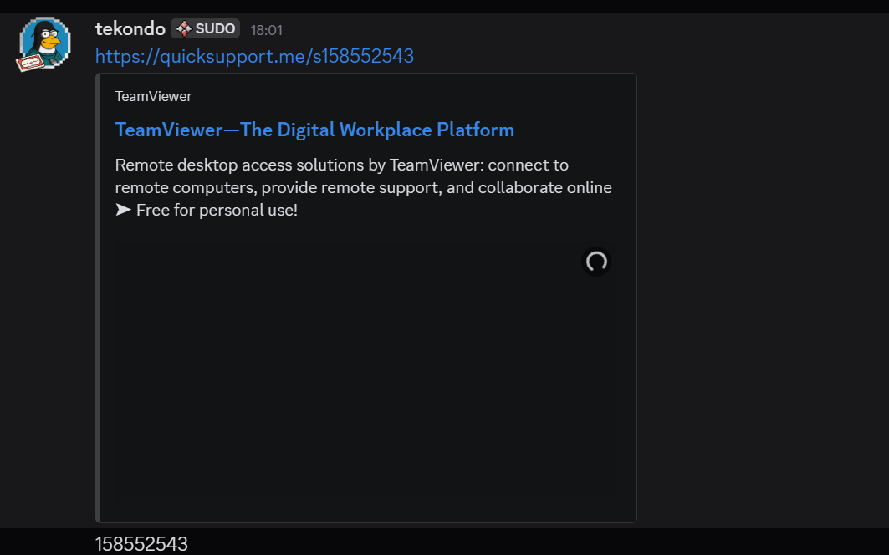

3. L’usuari introdueix el codi a TeamViewer.
   
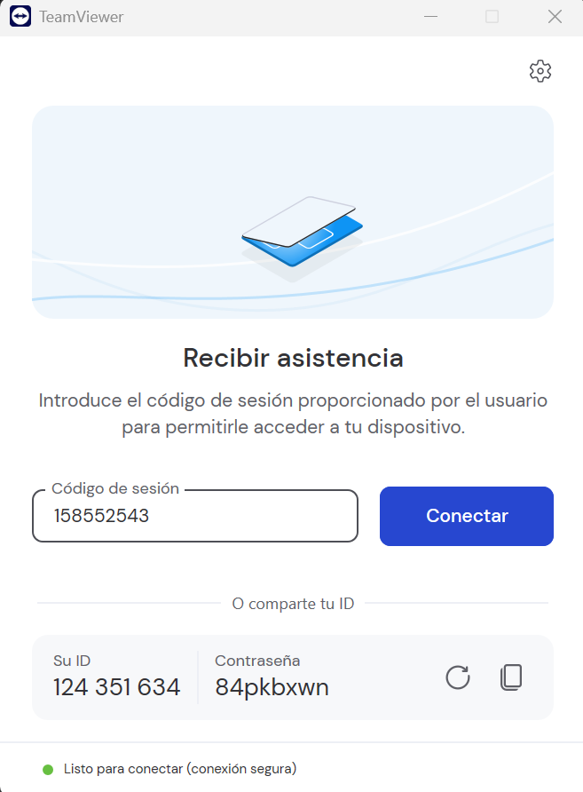

5. L’usuari accepta la connexió.

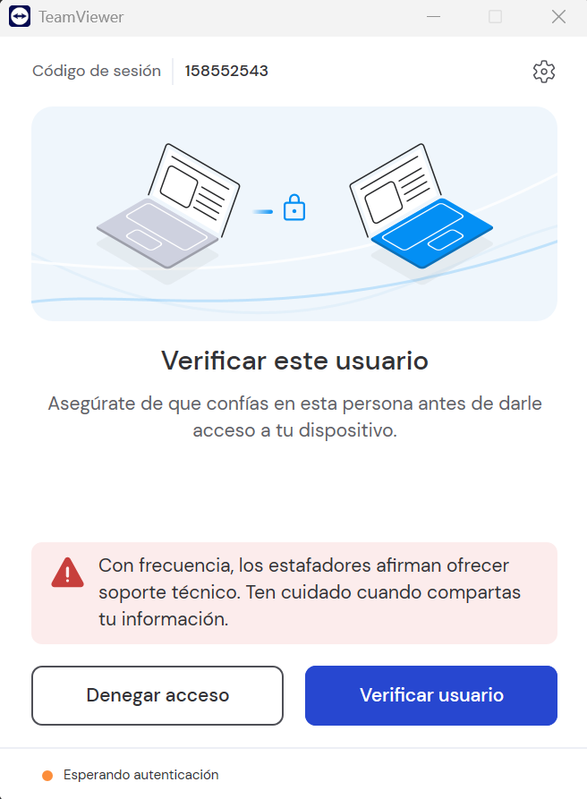
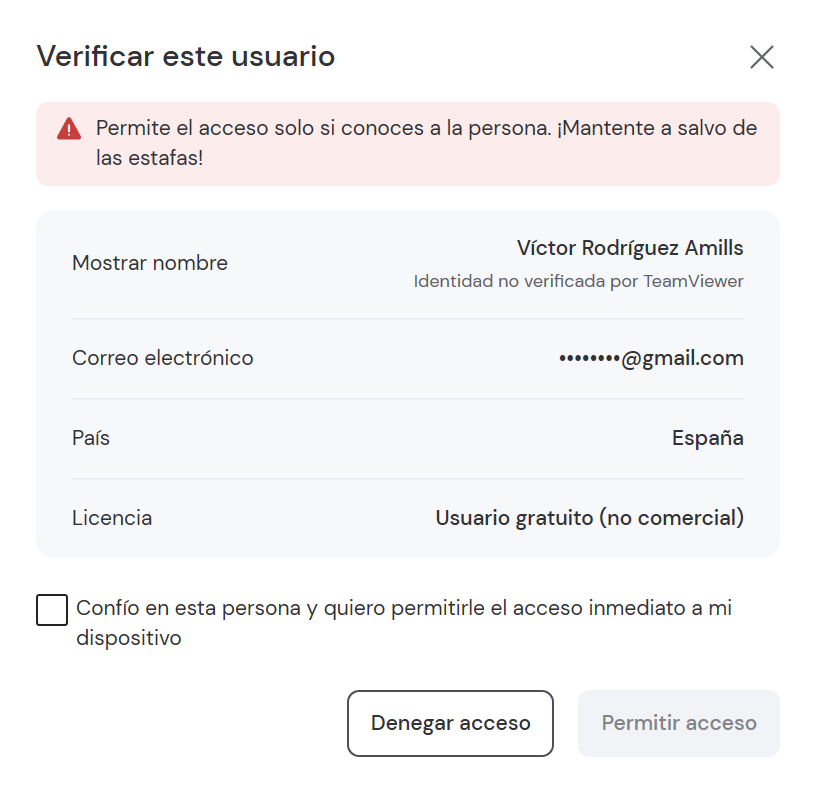

7. El tècnic accedeix a la sessió.
   

---

## 6. Funcionalitats durant la sessió remota

Un cop establerta la connexió, el tècnic pot:

### 6.1 Control remot
- Controlar **ratolí i teclat**
- Visualitzar la pantalla de l’usuari en temps real

### 6.2 Transferència d’arxius
- Enviar arxius a l’usuari
- Rebre documents de l’usuari

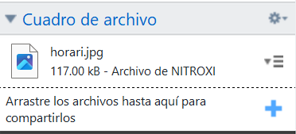

---

## 7. Configuració de permisos i seguretat

TeamViewer permet configurar els permisos de la sessió per garantir la seguretat:

### 7.1 Permisos configurables
L’usuari pot:
- Permetre o denegar el **control remot**
- Permetre o bloquejar la **transferència d’arxius**
- Permetre o denegar l’ús del **teclat i ratolí**
- Finalitzar la sessió en qualsevol moment
- Permetre configurar el **audio** i el **video** 
- També pots habilitar els **registres** o configurar el **proxy**

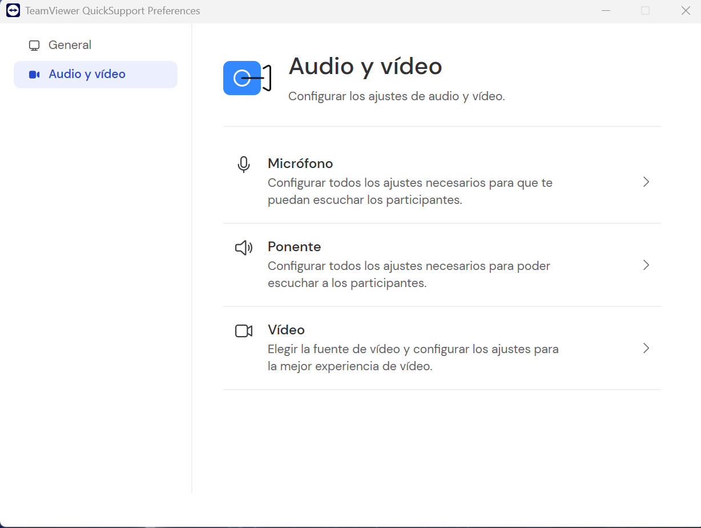

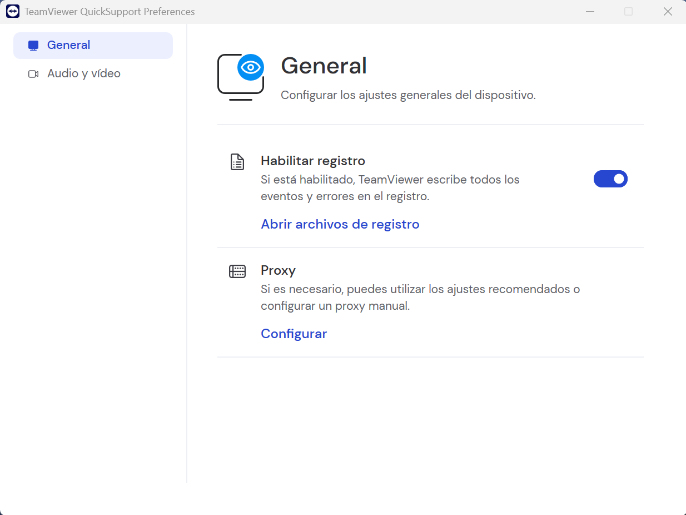

### 7.2 Seguretat
- Contrasenyes temporals
- Connexió xifrada
- Accés sempre sota confirmació de l’usuari

Això assegura la **privacitat i el control total** per part de l’usuari.

---

## 8. Finalització de la sessió

Quan el suport ha finalitzat:
- L’usuari pot tancar TeamViewer
- La connexió queda completament interrompuda
- La contrasenya deixa de ser vàlida

Per tornar a accedir, caldrà una nova autorització.

---
