# T09: Servidor fitxers Linux. NFS (tasca individual)


 
## Fase 1: Preparació de l'entorn 
Primer crear dues màquines virtuals: **servidor (Ubuntu)** i **client (Zorin)**, amb les mateixes interfícies:
- **NAT** per tenir accés a Internet  
- **Host Only** per a la comunicació entre les dues màquines

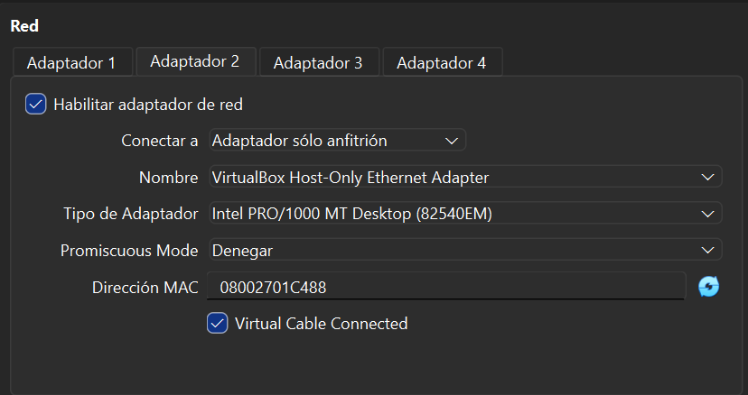

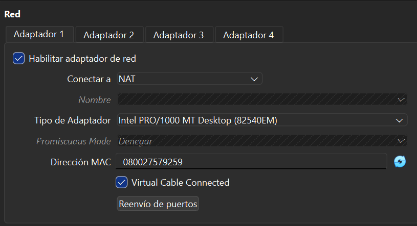

Quan ja tinguem tot ben configurat, actualitzem els dos equips amb:

```bash
sudo apt update && sudo apt upgrade -y
```

---

## Fase 2: Preparació del servidor

Per començar l'activitat, crearem dos grups: `devs` i `admins`, i dos usuaris:
- `dev01` (pertanyent al grup `devs`)
- `admin01` (pertanyent al grup `admins`)

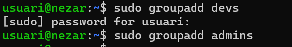

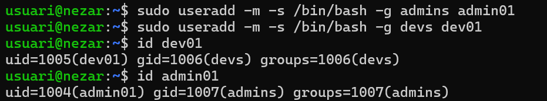

Creem la contrasenya als usuaris perquè puguin iniciar sessió.

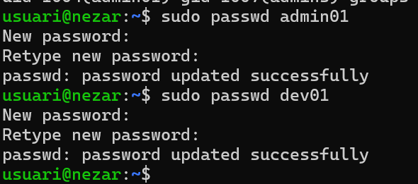

Després, creem una sèrie de carpetes amb la comanda `mkdir`.

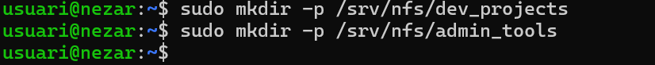

Un cop creades les carpetes:
- `dev_projects` tindrà com a propietari `root` i grup `devs`
- `admin_tools` tindrà com a propietari `root` i grup `admins`

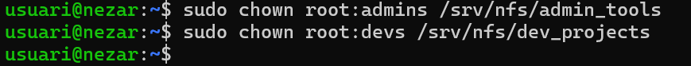

Després permetem que els usuaris i grups propietaris tinguin tots els permisos i comprovem l'estat amb:

```bash
ls -ld
```

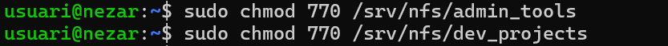

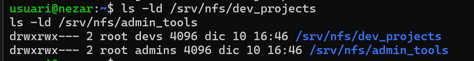

Un cop fet tot això, anem a la màquina client i creem els mateixos usuaris i grups.

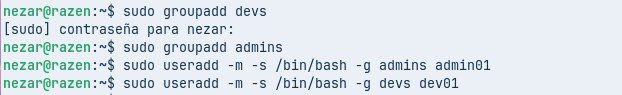

**Això és important:** hem de fer que els usuaris i els grups coincideixin amb el mateix ID. Jo no vaig assistir a la classe en què es va explicar l’aplicació **Users and Groups**, i ho he fet utilitzant comandes.

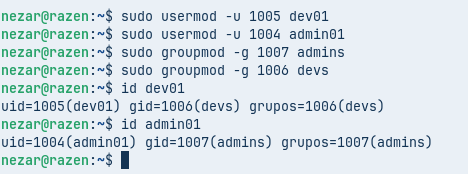

Ara, a la màquina servidor, instal·lem NFS amb:

```bash
sudo apt install nfs-kernel-server -y
```

Un cop instal·lat, editem l'arxiu `/etc/exports` per exportar les carpetes creades.

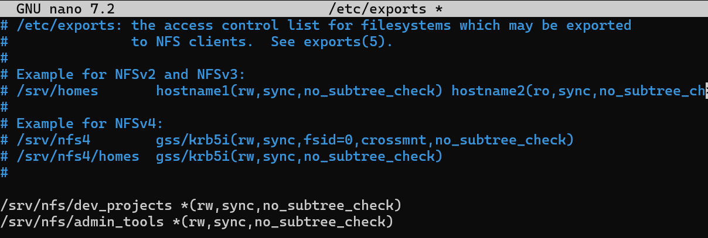

Guardem l'arxiu i reiniciem el servei:

```bash
sudo systemctl restart nfs-kernel-server
```

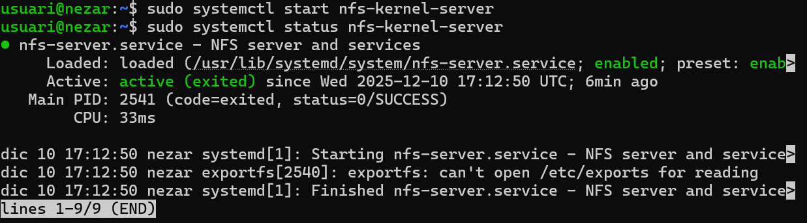

Comprovem que s'exporta correctament.

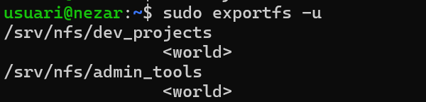

A la màquina client, instal·lem el client NFS:

```bash
sudo apt install nfs-common -y
```

I comprovem l'accés amb:

```bash
sudo showmount -e ip-servidor
```

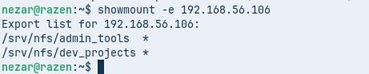

Creem la carpeta de muntatge:

```bash
mkdir -p /ruta/recipient
```

I muntem:

```bash
mount ip-servidor:/ruta/carpeta/servidor /ruta/recipient
```

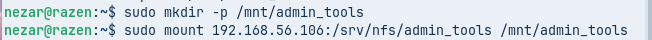

---

## Fase 3: L'Exportació d'Administració (El dilema del root_squash)

Per defecte, NFS activa `root_squash`, que fa que l'usuari `root` es transformi en `nobody`, impedint l'accés.

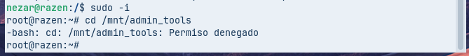

Si de manera momentània, permetem que altres usuaris accedeixin a la carpeta des del servidor, podem observar que el propietari de la carpeta apareix com a nobody.

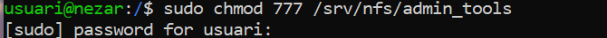

Qualsevol cosa creada per `root` passa a ser:
- usuari: `nobody`
- grup: `nogroup`

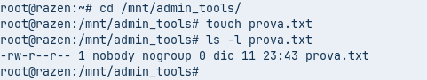  

Per solucionar-ho, a `/etc/exports` afegim l'opció:

```
no_root_squash
```

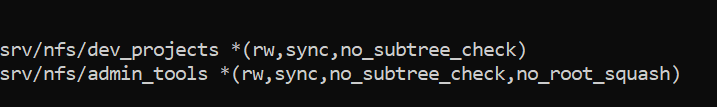

Després reiniciem el servei:

```bash
sudo systemctl restart nfs-kernel-server
```

I al client desmuntem i tornem a muntar:

```bash
sudo umount /mnt/admin_tools
sudo mount ip-servidor:/srv/nfs/admin_tools /mnt/admin_tools
```

Ara ja podem accedir amb normalitat.

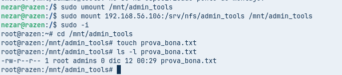

---

## Fase 4: L'Exportació de Desenvolupament (Permisos rw vs ro)

Editem `/etc/exports` i afegim dues exportacions:

```
/srv/nfs/dev_projects ip-escriure(rw,sync,no_root_squash)
/srv/nfs/dev_projects ip-llegir(ro,sync,no_root_squash)
```

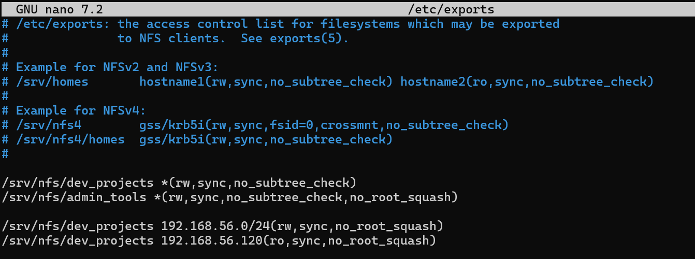

Reiniciem el servei:

```bash
sudo systemctl restart nfs-kernel-server
```

A la màquina client:

```bash
sudo mkdir /carpeta/recipient
sudo mount ip-servidor:/srv/nfs/dev_projects /mnt/dev_projects
```

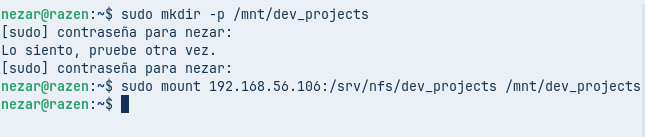

Creem un arxiu i comprovem permisos amb:

```bash
ls -la
```

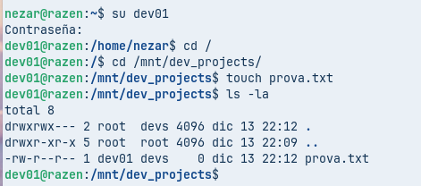

Canviem la IP del client

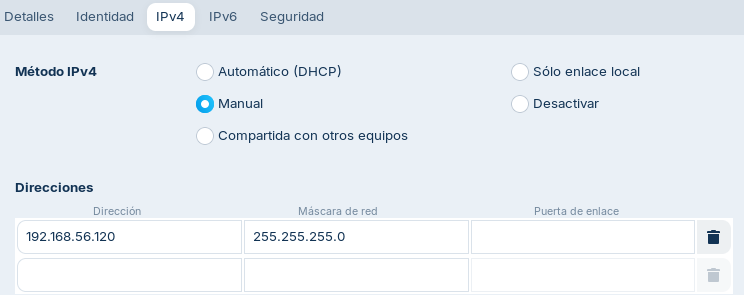

i comprovem que s’ha aplicat correctament:

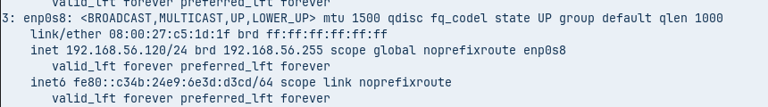

Ara desmuntem i muntem un altre cop la carpeta

```bash
sudo umount /mnt/dev_projects
sudo mount ip-servidor:/srv/nfs/dev_projects /mnt/dev_projects
```

i comprovem que:
- només es permet lectura
- els usuaris fora del grup `devs` no poden fer cap acció

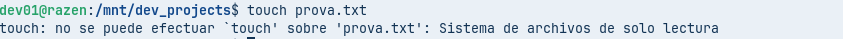

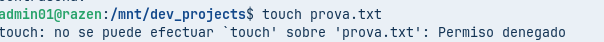

---

## Fase 5: Muntatge automàtic amb /etc/fstab

N’hi ha una opció per facilitar-nos la vida i muntar automàticament les carpetes que vols compartir.

Per muntar automàticament les carpetes, editem `/etc/fstab`:

```bash
sudo nano /etc/fstab
```

Afegim:

```
ip-server:/srv/nfs/admin_tools /mnt/admin_tools nfs defaults 0 0
ip-server:/srv/nfs/dev_projects /mnt/dev_projects nfs defaults 0 0
```

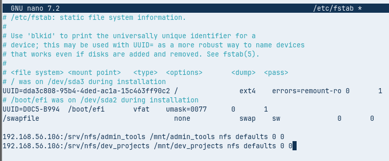

Comprovem:

```bash
sudo mount -a
```

I reiniciem la màquina client per verificar que el muntatge és correcte.

I ja estaria 👍


---

- [**Tornar al readme**](README.md)
- [**Tornar el projecte**](../README.md)
